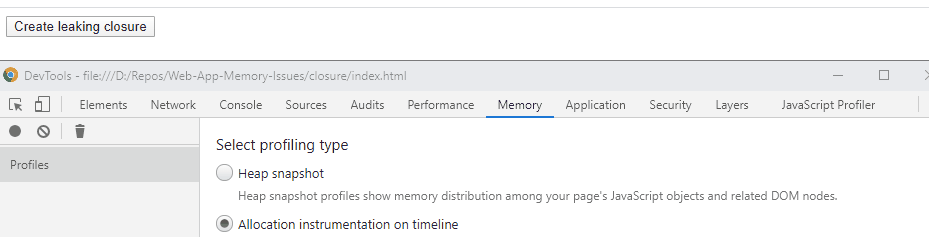
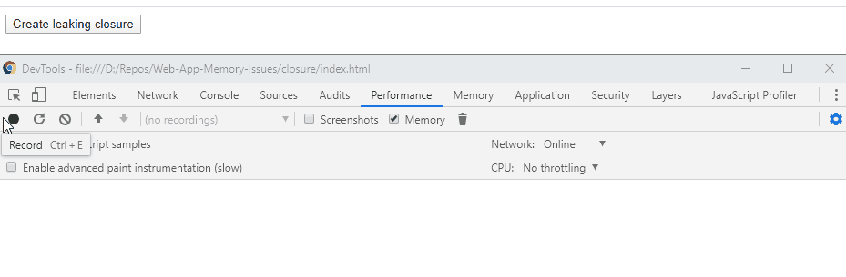
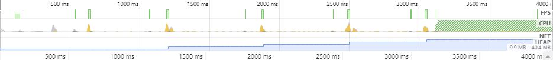

# Closure leaking

A **closure** is an expression that has free variables together with an environment that bind those variables. A **free variable** is a variable that is defined outside of the scope of where it is used. In the example below, the *setInterval*'s callback has a free variable *localObject*, which is declared outside the callback scope, but used inside it.

```javascript
const localObject = new Array(1000000).fill(1);

setInterval(() => { console.log(localObject.length); }, 100);
```

## Example

Basing on this example you will see how to identify and search for closure leaks.

First we will identify the leak in the *Memory* tab.

1. Open the *index.html* file in *Chrome*
2. Open *Chrome DevTools* (F12)
3. Press *Alt + Shift + P*
4. Search for *memory* and choose *Show Memory*
5. Select the *Allocation instrumentation on timeline* option
6. Press the dot on the top left to start recording memory timeline
7. Click the *Create leaking closure* button



As you can observe, each button click causes the allocation of new memory, which is never released.

The same situation can be spotted in the *Performance* tab.

1. Open the *index.html* file in *Chrome*
2. Open *Chrome DevTools* (F12)
3. Press *Alt + Shift + P*
4. Search for *performance* and choose *Show Performance*
5. Press the dot on the top left to start recording memory timeline
6. Click the *Create leaking closure* button several times
7. Stop the recording



The blue part marked on the timeline is the memory usage. It is visible at the bottom of the timeline. Yellow heaps indicate mouse clicks. You can easily observe that with each click the memory used increases instantly. The blue part gets bigger with every click.


