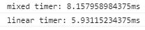

# Data locality

Every object that is created in the code is kept in some kind of memory. But as you create and remove objects, the memory gets sliced and becomes a set of used and unused fragments. Therefore it is most likely that most objects that are kept in the memory consist of memory fragments, that are not next to each other.

To speed up the access time, some of the requested data is kept in memory cache. But it may occur that when you request for a specific object's property, it may not be cached. Therefore another request is necessary to get the missing data, which causes execution delays. This state with missing information is called **cache miss**.

## Example

You can cause cache miss if you process the data in a way that the following data is far away from the last processed part. A great example is iterating through an array of objects. Instead of accessing cells in a regular sequence (0, 1, 2, 3, ...) you can change the index sequence (0, 1000, 2000, 1, 1001, 2001, ...).

To check the actual computation time we will use ```console.time``` method.

1. Open the *index.html* file in *Chrome*
2. Open *Chrome DevTools* (F12)
3. Go to *Console* tab
4. Press the first button and wait for the computation to be finished
5. Press the second button and wait for the computation to be finished

As you can observe in the console, the computation times are quite different. When accessing array cells in the ordered sequence the function runns much faster than in the other case. You can see the results below.

;
