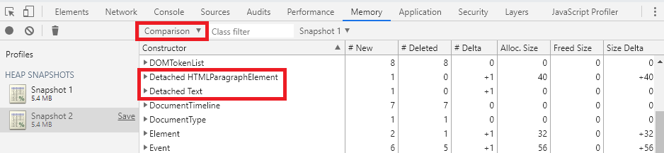
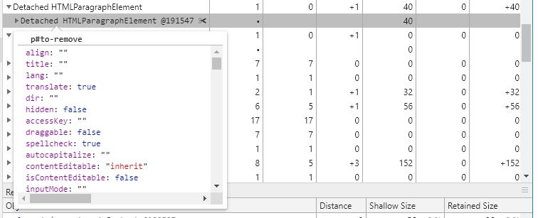
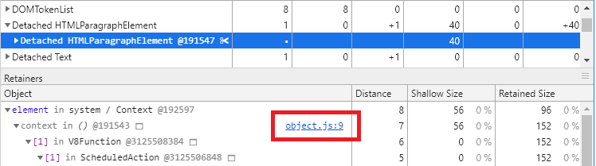

# DOM leaking

It's sometimes useful to find, store and manipulate DOM objects in JavaScript code. Unfortunately it may cause memory leaking problems. 

The problem appears when the reference in code is still kept, but the node itself was removed from the document. These kind of errors are hard to find, as DOM objects tend to use only small amounts of memory.

The example below shows such case, when the reference to the DOM node is kept by the callback, when the object was already removed from the DOM.

```javascript
let element = document.getElementById('to-remove');
document.body.removeChild(element);

setInterval(() => { console.log(element.innerHTML); }, 100);
```

## Example

Basing on this example you will see how to identify and search from DOM leaks.

After clicking the button the text node will be removed from the DOM. Apart from that, an interval will be set, that will log the text's content to the console every 100ms.

1. Open the *index.html* file in *Chrome*
2. Open *Chrome DevTools* (F12)
3. Press *Alt + Shift + P*
4. Search for *memory* and choose *Show Memory*
5. Select the *Heap snapshot* option
6. Press the dot on the top left to take a snapshot of the initial page
7. Click the *Remove DOM object* button
8. Press the dot on the top left once again to take a snapshot of the page after removing the text
9. Select the *Comparison* option from the dropdown menu in the snapshot details view
10. Sort the records by the *Constructor* column ascending



The nodes that were removed from the DOM, but are still kept in the memory will be marked with *Detached ...* name. Find such nodes and expand its object tree. The first child will be the DOM node that was removed. You can hover over it and peek on its properties.



 After selecting such node, the *Retainers* section will be filled with data, showing objects that refer the selected node. As you expand the retainers' nodes, you will notice JavaScript file names next to some nodes. These are links to source files, in which the detached nodes are references. This way you can navigate straight to the code that keeps the reference to the detached DOM element. Objects written in blue font are the actual instances that are keeping the references to the objects.


