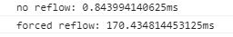
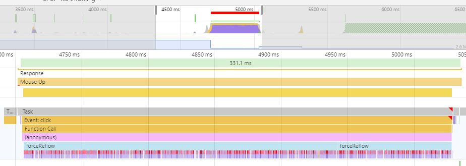
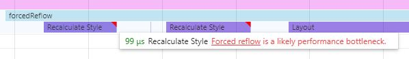
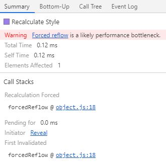
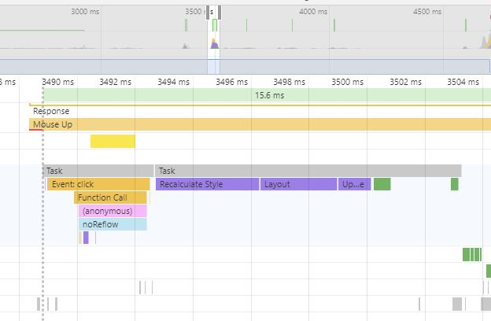

# Forced reflow

Each web page consists of a number of HTML, CSS and JavaScript files. Browsers interpret those files and basing on their content render the page. The sequence of rendering steps is called **Critical Rendering Path (CRP)**. It is composed of five steps:

* **JavaScript**
* **Style**
* **Layout**
* **Paint**
* **Composite**

For the best rendering performance results the rendering should happen in the sequence defined above. In some specific cases you can force a different order of these phases. The layout phase can be called after the style phase and during the JavaScript phase. This is called the **forced reflow** and may be the cause of serious performance issues.

The forced reflow causes the layout phase to be executed during the JavaScript phase, which interferes the CRP. The layout phase calculates the layout for each HTML element on the page. This is an expensive process. Making it appear in the CRP more than one time expands the rendering time significantly. What's worse, the rendering time grows with the raising number of HTML elements on the page.

## The cause

But what exactly causes the forced reflow? The calls in JavaScript code that access DOM elements may be **measuring (computing)** or **mutating (updating)** the document. Measurement actions need to be performed on the latest DOM version. If any mutation was done upfront, the whole page layout needs to be re-calculated in order to perform the computations on the newest version of the DOM. This causes the Layout phase to be executed during the JavaScript phase.

## Example

In this example both buttons resize the gray bars. There are 500 bars taken for recalculation. The example with forced reflow assigns the new width of the bar and next gathers the width of some other component. This way we have mutation followed by the measurement done 500 times. The no reflow example caches the width of the component upfront and further does only the width assignment to the bars. Therefore all mutations come after the measurements.

1. Open the *index.html* file in *Chrome*
2. Open *Chrome DevTools* (F12)
3. Go to *Console* tab
4. Press the first button and wait for the computation to be finished
5. Press the second button and wait for the computation to be finished

As you can see in the console output, the forced reflow causes the function to run significantly longer than when no reflow is forced. The no reflow example is more than 200 times faster than the one with reflow. The computation was done for 500 elements, but was setting just one property of the object on a really simple page. With more elements, more complex site and more reflows the duration would grow even bigger.

## Investigating and fixing the issue

Forced reflow can be spotted by using the Performance tab of the Chrome DevTools. The timeline is characteristic for this problem. At the bottom of the timeline you can see a lot of violet bars. These are the *layout* and *recalculate style* phases being called over and over again. As you can see, it all happens during the evaluation of the JavaScript *forcedReflow* method which is just above them, marked with the light green color.

The red bars are actually markers that appear at the top of the violet bars. They are warnings from the DevTools that notify you that the forced reflow is happening. It is better visible on a zoomed-in view of the timeline. It also links to the [Google Developers site](https://developers.google.com/web/fundamentals/performance/rendering/avoid-large-complex-layouts-and-layout-thrashing#avoid-forced-synchronous-layouts) that can bring you more information about this performance issue.

When you click on one of the violet bars, you will see more information in the Summary section. You can find the information about the reflow there as well as the link to the actual line in the code that causes the reflow issue.

The question is, how to fix such issues? The one and only rule that will prevent you from the forced reflow issue is:

Measure before Mutate

When all measurements are done before mutations, the *layout* phase and the *recalculate styles* phase are called only once during the CRP. It can be spotted on the timeline for the no reflow example.

[Go to top](#forced-reflow)  
[Go to main page](../README.md)
