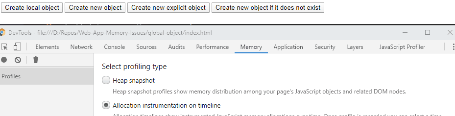
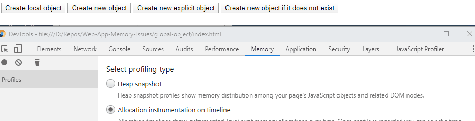

# Memory leaks due to global objects

Objects created in the global scope can be the cause of memory leaks. Especially when a global variable is instantiated by mistake and stays in the application memory, even though references to this objects are no longer existing.

A global variable can be instantiated implicitly, by omitting *this* keyword.

```javascript
globalObject = new Array(1000000).fill(1);
```

An explicit instantiation can be made by referencing the *window* object.

```javascript
window.globalObject = new Array(1000000).fill(1);
```

## Example

In this example there are a few buttons, each of them creating an array of 1 000 000 elements. Each cell value is set to 1.

1. Open the *index.html* file in *Chrome*
2. Open *Chrome DevTools* (F12)
3. Press *Alt + Shift + P*
4. Search for *memory* and choose *Show Memory*
5. Select the *Allocation instrumentation on timeline* option
6. Press the dot on the top left to start recording memory timeline

### Local object

Press the first button that instantiates the local object. The local object is destroyed and the memory that it was taking is released right after the function finishes. Therefore it is hard to even notice the memory usage change during the function run time.

### Global object

All other buttons instantiate global objects, but in different ways. In all cases of global objects you can observe that the memory usage grows as the global object is instantiated, but is no longer released after the function finishes.

The second and third button always assign a new object to the global variable.


The last one on the other hand, does so only if the global instance object does not exist.

The allocated memory is marked with the blue bar. The gray bar stands for the already released memory that was previously allocated.

You can observe that in the first example the allocated memory changes with each button press. In the example with re-using the existing instance, the memory is allocated just once. This way the Garbage Collector has less work to do and the function runs a bit faster.
