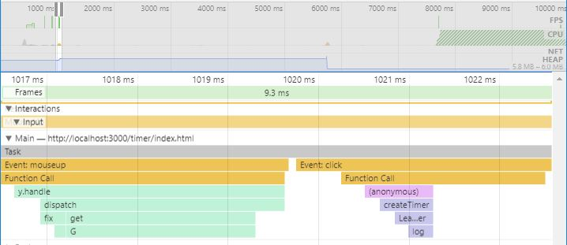
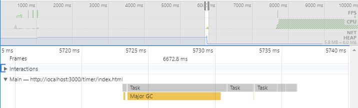

# Forgotten callback / timer

The use of *setInterval* and callbacks is common in JavaScript. What's also common is forgetting to release references to such objects. Even when their owner is no longer referenced, references to callbacks and timers stay in the memory. This way their owner is prevented from being disposed as well. Both the timer and its owner will be disposen when the timer finishes execution.

## Example

This example shows that timers and their owners are disposed by the GC after the timer finishes its execution.

1. Open the *index.html* file in *Chrome*
2. Open *Chrome DevTools* (F12)
3. Press *Alt + Shift + P*
4. Search for *performance* and choose *Show Performance*
5. Press the dot on the top left to start recording memory timeline
6. Click the *Create leaking timer* button and wait for 10s
7. Stop the recording

The timeline in the Performance tab of Chrome DevTools shows the usage of resources during the test run. The blue area indicates the memory usage. As you can see, all the used memory was disposed after about 6 seconds. This is exactly the amount of time that took me to invoke the timer combined with the duration of the timer (5s).


When you zoom in (you can do that using the mouse scroll), you will see the actions that took place at that time. Those actions are visible below the timeline as a call tree.

Zoom in the area at 1s, where the memory was rising. In the *Interactions* section you will see the *Mouse Up* event that triggered the *createTimer* function. The memory allocated by this function was being kept until the timer finished its execution.



Now zoom in the area at 6s, where the memory is released. The only action happening at that time was the Major GC, which released all the memory kept by the timer.



## How to prevent and fix such problems

### Timers

Each call to *setInterval* or *setTimeout* returns a numeric value. This value is the identifier of the handle thet can be used to identify the timer. Using this number you can easily clear timers when they are no longer necessary.

```javascript
const timeoutId = setTimeout(() => {
    console.log('Logging to the console.');
}, 500);

const intervalId = setInterval(() => {
    console.log('Logging to the console.');
}, 500);

clearTimeout(timeoutId);
clearInterval(intervalId);
```

### Callbacks

Setting a callback does not return any value. Adding and removing needs to by passing the same handler to both add and remove methods.

```javascript
document.addEventListener('click', onClickHandler);
document.removeEventListener('click', onClickHandler);
```

[Go to top](#forgotten-callback--timer)  
[Go to main page](../README.md)
